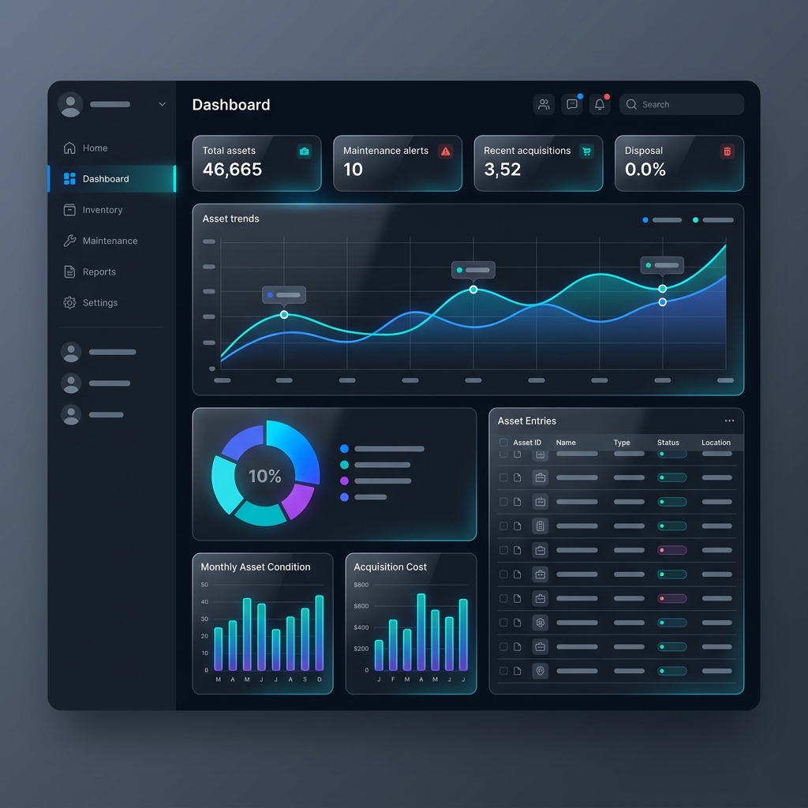

# BMN Management System (RiskManagement)



## 🚀 Overview
**BMN Management System** adalah platform modern yang dirancang untuk mengelola Barang Milik Negara (BMN) dengan efisiensi tinggi, akurasi data yang ketat, dan antarmuka pengguna yang elegan. Sistem ini sepenuhnya kompatibel dengan skema data **SIMAN v2** dan mendukung pengelolaan aset tetap maupun aset lancar (persediaan).

---

## ✨ Fitur Unggulan

### 📊 Dashboard Monitoring
Visualisasi data aset secara real-time, statistik kondisi barang, dan notifikasi untuk pemeliharaan yang akan datang.

### 📥 Bulk Import & Export (SIMAN v2 Ready)
- Mendukung unggahan file Excel dan CSV dalam jumlah besar (hingga 100.000+ baris).
- **Progress Tracking Real-time**: Pantau kemajuan import detik demi detik dengan persentase dan jumlah data yang masuk secara otomatis.
- Validasi data otomatis untuk memastikan kompatibilitas dengan SIMAN v2.

### 🔍 QR Code & Sensus Digital
- Generasi QR Code unik untuk setiap aset.
- Fitur scanner terintegrasi untuk memperbarui status inventarisasi (sensus) langsung dari lapangan.

### 🛠️ Manajemen Lifecycle Aset
- **Distribusi & Penugasan**: Lacak siapa yang bertanggung jawab atas aset tertentu.
- **Maintenance**: Jadwalkan dan catat riwayat pemeliharaan barang.
- **Asuransi & Kinerja**: Pantau status perlindungan aset dan efektivitas penggunaannya.

### 🔐 Keamanan & Log Aktivitas
- Manajemen hak akses pengguna (Admin & User).
- **Activity Logs**: Mencatat setiap perubahan data untuk audit trail yang transparan.

---

## 📖 Panduan Penggunaan (Manual)

### 1. Proses Import Data Besar
Untuk memastikan stabilitas saat mengunggah ribuan data:
1. Pastikan file Anda mengikuti format template yang disediakan.
2. Sangat disarankan menggunakan format **CSV** untuk file di atas 50.000 baris.
3. Jalankan `php artisan queue:work` di server untuk memproses data di latar belakang.
4. Jangan menutup halaman saat progress bar sedang berjalan.

### 2. Melakukan Sensus Aset
1. Masuk ke menu **Scanner** di dashboard.
2. Scan QR Code yang tertempel pada fisik barang.
3. Klik tombol **Mutakhirkan Inventarisasi** untuk mencatat bahwa barang tersebut telah terdata/ditemukan.

### 3. Ekspor Laporan
1. Filter data berdasarkan kategori, kondisi, atau lokasi yang diinginkan.
2. Klik tombol **Export** untuk mengunduh laporan dalam format Excel yang rapi.

---

## 🛠️ Instalasi

1. Clone repository:
   ```bash
   git clone https://github.com/riyantoabuwinner/bmn.git
   ```
2. Install dependencies:
   ```bash
   composer install
   npm install && npm run dev
   ```
3. Setup environment:
   ```bash
   cp .env.example .env
   php artisan key:generate
   ```
4. Database migration & seeding:
   ```bash
   php artisan migrate --seed
   ```
5. Jalankan server:
   ```bash
   php artisan serve
   ```

---

## 🎨 Design Philosophy
Aplikasi ini mengusung tema **Modern AdminLTE** dengan kustomisasi CSS yang elegan, fokus pada keterbacaan data, dan transisi yang halus untuk pengalaman pengguna yang premium.

---
© 2026 Developed with ❤️ for Government Asset Excellence.
